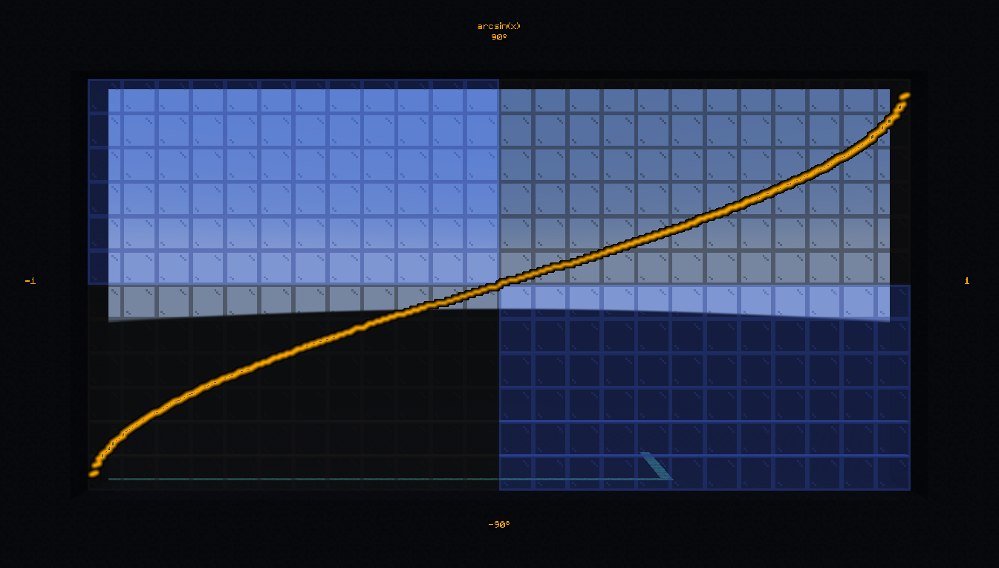
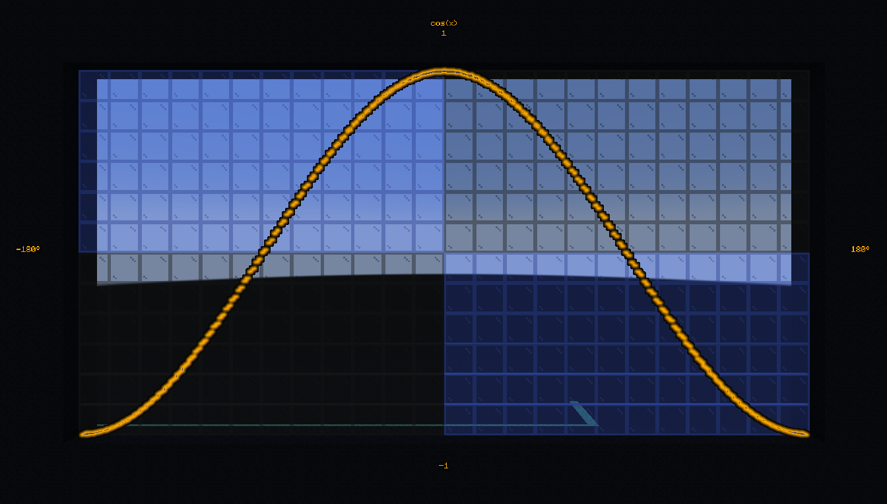
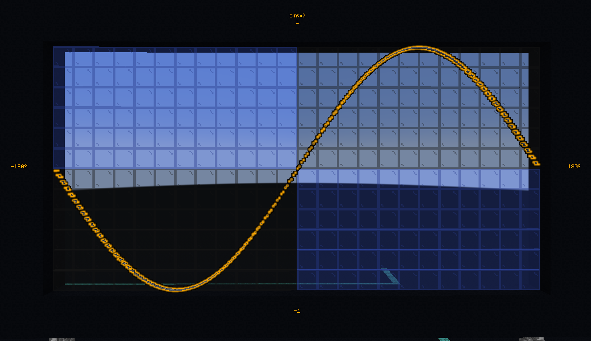
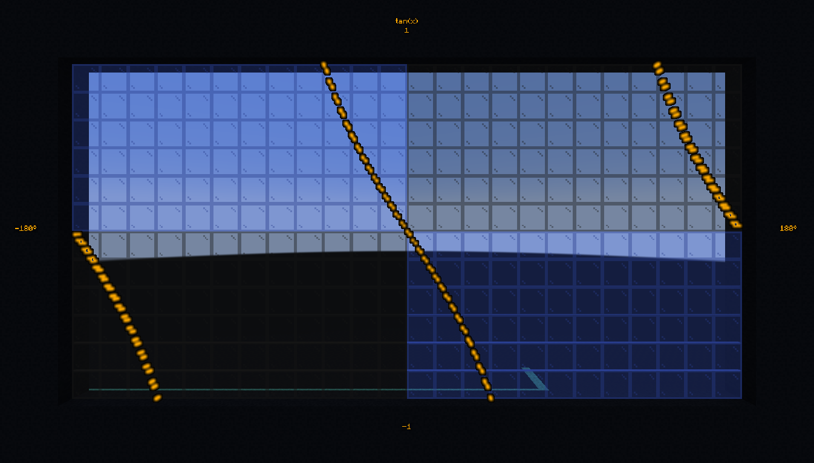
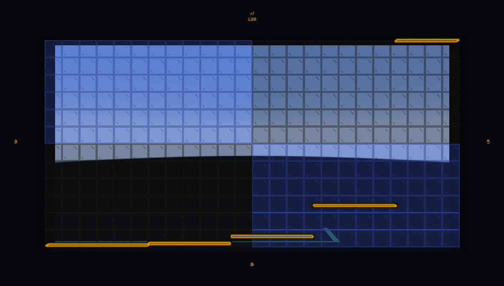
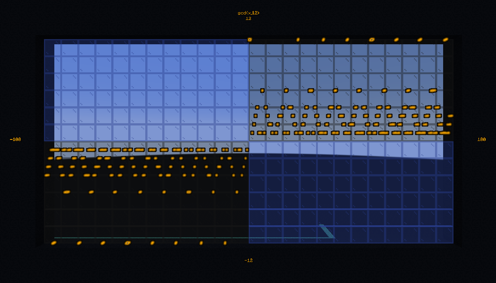
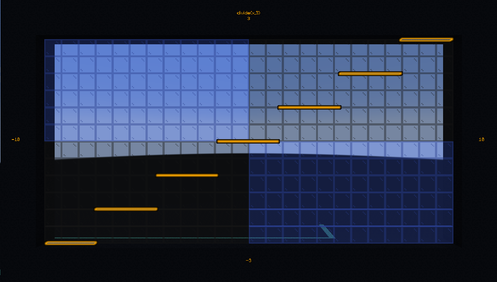
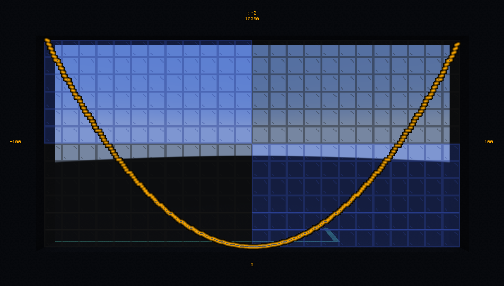
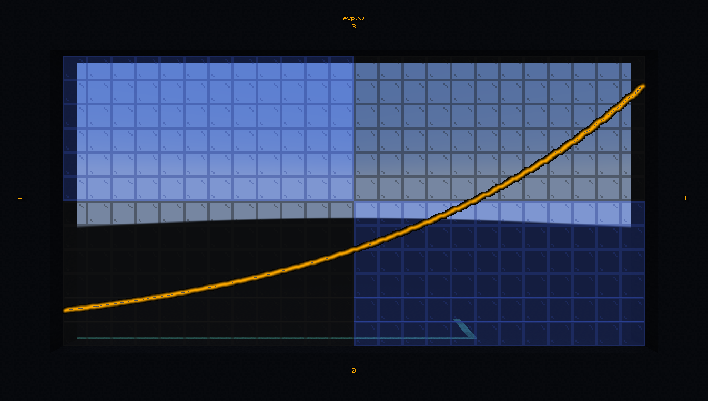

# 🧮 Math

**`#bs.math:help`**

The beatifull world of mathematics... **in Minecraft!**

<div align=center>


</div>

```{button-link} https://youtu.be/Bt0HKaOosqU
:color: primary
:align: center
:shadow:

{octicon}`device-camera-video` Watch a demo
```

```{epigraph}
"Mathematics has very subtle inventions that can be of great service, both to satisfy the curious and to facilitate all arts and reduce the labor of men."

-- René Descartes
```

---

## 🔧 Functions

You can find below all the function available in this module.

---

### Arccosine

**`#bs.math:acos`**

Calculate the arccosinus of a value between -1 and 1.

Inputs

:  (score) `$math.acos.value bs.in`
   : The value you want to calculate the arccosine of, shifted by 3 digits (1,2345 -> 1234) for better precision in integer scores.

Output

:  (score) `$math.acos bs.out`
   : The result of the calculation, in degrees (shifted by 2 digits).

Example

:  Calculate and display the arccos of 0,42:
   ```mcfunction
   # Once
   scoreboard players set $math.acos.value bs.in 420
   function #bs.math:acos
   tellraw @a [{"text":"acos(0.42) = ","color":"dark_gray"},{"score":{"name":"$math.acos","objective":"bs.out"},"color":"gold"}]
   ```


> **Credits**: Aksiome, KubbyDev

---

### Arcsine

**`#bs.math:asin`**

Compute the arcsinus of a value between -1 and 1.

Inputs

:  (score) `$math.asin.value bs.in`
   : The value you want to calculate the arcsine of, shifted by 3 digits (1,2345 -> 1234) for better precision in integer scores.

Output

:  (score) `$math.asin bs.out`
   : The result of the calculation, in degrees (shifted by 2 digits).

Example

:  Calculate and display the arcsinus of 0.42:
   ```mcfunction
   # Once
   scoreboard players set $math.asin.value bs.in 420
   function #bs.math:asin
   tellraw @a [{"text":"asin(0.42) = ","color":"dark_gray"},{"score":{"name":"$math.asin","objective":"bs.out"},"color":"gold"}]
   ```



> **Credits**: Aksiome, KubbyDev

---

### Arctangent

**`#bs.math:atan`**

Compute the arctangent of a value between -infinite and +infinite.

Inputs

:  (score) `$math.atan.value bs.in`
   : The value you want to calculate the arctangent of, shifted by 3 digits (1,2345 -> 1234) for better precision in integer scores.

Output

:  (score) `$math.atan bs.out`
   : The result of the calculation, in degrees (shifted by 2 digits).

Example

:  Calculate and display the arctan of 0.42:
   ```mcfunction
   # Once
   scoreboard players set $math.atan.value bs.in 420
   function #bs.math:atan
   tellraw @a [{"text":"atan(0.42) = ","color":"dark_gray"},{"score":{"name":"$math.atan","objective":"bs.out"},"color":"gold"}]
   ```


> **Credits**: Aksiome, Leirof

---

### Arctangent 2

**`#bs.math:atan2`**

Compute the 2-argument arctangent of y and x.

Inputs

:  (scores) `$math.atan2.[y,x] bs.in`
   : The values you want to calculate the arctangent of, shifted by 3 digits (1,2345 -> 1234) for better precision in integer scores.

Output

:  (score) `$math.atan2 bs.out`
   : The result of the calculation, in degrees (shifted by 2 digits).

Example

:  Calculate and display the atan2 of (0.42, 0.8):
   ```mcfunction
   # Once
   scoreboard players set $math.atan2.y bs.in 420
   scoreboard players set $math.atan2.x bs.in 800
   function #bs.math:atan2
   tellraw @a [{"text":"atan2(0.42, 0.8) = ","color":"dark_gray"},{"score":{"name":"$math.atan2","objective":"bs.out"},"color":"gold"}]
   ```

> **Credits**: Aksiome

---

### Basis rotation 3D

**`#bs.math:basis_rot_3d`**

Allows to obtain the equivalent of the vector
passed in parameter in a base with a different orientation. Useful to
convert an absolute/relative position into a local position for a given
entity.

Inputs

:  (scores) `$math.basis_rot_3d.[x,y,z] bs.in`
   : Vector coordinates $(X,Y,Z)$ in the starting base (shifted by 3 digits).

   (scores) `$math.basis_rot_3d.[h,v] bs.in`
   : Horizontal angle $\phi$ (along $\hat{y}$) and vertical angle $\theta$ (along $\hat{\phi}$) rotation (in degree) from the starting base (shifted by 2 digits).

   ```{admonition} Basis system
   :class: info

   This system use the Minecraft coordinate system. Thus:
   - $\hat{y}$ is the vertical axis.
   - $\phi=0$ (starting point of the horizontal angle) is along the $\hat{z}$ axis.
   - $\theta=0$ (starting point of the vertical angle) is on the horizontal plane.
   ```

Outputs

:  (scores) `$math.basis_rot_3d.[x,y,z] bs.out`
   : Vector coordinates $(X',Y',Z')$ in the target base.

Examples

:  A block is in ~2 ~5 ~10 from me, I want to have this position in local coordinate (^? ^? ^?):

   ```mcfunction
   # One time

   # Relative coordinates (we multiply by 1000 to have more precision on the result, which will also be multiplied by 1000)
   scoreboard players set $math.basis_rot_3d.x bs.in 2000
   scoreboard players set $math.basis_rot_3d.y bs.in 5000
   scoreboard players set $math.basis_rot_3d.z bs.in 10000

   # Difference between my rotation (= that of the coondata grid ^X ^Y ^Z) and the rotation of the Minecraft blocks grid (~X ~Y ~Z)
   function #bs.position:get_rot {scale:100}
   scoreboard players operation $math.basis_rot_3d.h bs.in = @s bs.rot.h
   scoreboard players operation $math.basis_rot_3d.v bs.in = @s bs.rot.v

   # Perform the basic rotation
   function #bs.math:basis_rot_3d

   # See the result
   tellraw @a [{"text": "X = ", "color": "dark_gray"},{"score":{"name":"$math.basis_rot_3d.x", "objective": "bs.out"}, "color": "gold"},{"text":", Y = ", "color": "dark_gray"},{"score":{"name":"$math.basis_rot_3d.y", "objective": "bs.out"},"color":"gold"},{"text":", Z = ","color":"dark_gray"},{"score":{"name":"$math.basis_rot_3d.z","objective":"bs.out"},"color":"gold"}]
   ```

   I want to have a vector pointing to where I'm looking, but in relative coordinates ~X ~Y ~Z (also called "classical" vector in this library)

   ```mcfunction
   # Once

   # Retrieve a vector ^ ^ ^1 corresponding to a vector directed according to the orientation of the entity (we multiply by 1000 to have more precision on the result, which will also be multiplied by 1000)
   scoreboard players set $math.basis_rot_3d.x bs.in 0
   scoreboard players set $math.basis_rot_3d.y bs.in 0
   scoreboard players set $math.basis_rot_3d.z bs.in 1000

   # Get the orientation
   function #bs.position:get_rot {scale:100}
   scoreboard players operation $math.basis_rot_3d.h bs.in = @s bs.rot.h
   scoreboard players operation $math.basis_rot_3d.v bs.in = @s bs.rot.v

   # Reversal of the orientation since we want to have the relative orientation of the game grid compared to the orientation of the player (unlike the previous example)
   scoreboard players operation $math.basis_rot_3d.h bs.in *= -1 bs.const
   scoreboard players operation $math.basis_rot_3d.v bs.in *= -1 bs.const

   # Perform the basic rotation
   function #bs.math:basis_rot_3d

   # See the result
   tellraw @a [{"text": "X = ", "color": "dark_gray"},{"score":{"name":"$math.basis_rot_3d.x", "objective": "bs.out"}, "color": "gold"},{"text":", Y = ", "color": "dark_gray"},{"score":{"name":"$math.basis_rot_3d.y", "objective": "bs.out"},"color":"gold"},{"text":", Z = ","color":"dark_gray"},{"score":{"name":"$math.basis_rot_3d.z","objective":"bs.out"},"color":"gold"}]
   ```

> **Credits**: Leirof

---

### Cosine

**`#bs.math:cos`**

Compute the cosine of an angle between 0 and 360.

Inputs

:  (score) `$math.cos.angle bs.in`
   : The angle in degrees shifted by 2 digits (ex: 90.15 -> 9015).

Outputs

:  (score) `$math.cos bs.out`
   : The cosine of the angle shifted by 3 digits (ex: 0.42 -> 420).

Example

:  Calculate and display the cosine of 42:
   ```mcfunction
   # Once
   scoreboard players set $math.cos.angle bs.in 4200
   function #bs.math:cos
   tellraw @a [{"text": "cos(42) = ", "color": "dark_gray"},{"score":{"name":"$math.cos", "objective": "bs.out"}, "color": "gold"}]
   ```



> **Credits**: Aksiome, Leirof

---

### Sine

**`#bs.math:sin`**

Computes the sine of an angle between 0 and 360.

Inputs

:  (score) `$math.sin.angle bs.in`
   : The angle in degrees shifted by 2 digits.

Outputs

:  (score) `$math.sin bs.out`
   : The sine of the angle shifted by 3 digits (ex: 0.42 -> 420).

Example

:  Calculate and display the sine of 42
   ```mcfunction
   # Once
   scoreboard players set $math.sin.angle bs.in 4200
   function #bs.math:sin
   tellraw @a [{"text": "sin(42) = ", "color": "dark_gray"},{"score":{"name":"$math.sin", "objective": "bs.out"}, "color": "gold"}]
   ```

```{admonition} How does it work?
:class: dropdown

This function use the Bhaskara approximation which tell us that

$$
\sin(x) \approx \frac{4x(180-x)}{40500-x(180-x)} \quad \forall x \in [0, 180]
$$

From this relation, and using the properties
- $\sin(-x) = -\sin(x)$ (antisymetry)
- $\sin(x+360) = \sin(x)$ (periodicity)

We can compute the sine of any angle.


```



> **Credits**: Aksiome, Leirof

---

### Tangent

**`#bs.math:tan`**

Compute the tangent of an angle between 0 and 360.

Inputs

:  (score) `$math.tan.angle bs.in`
   : The angle in degrees shifted by 2 digits.

Outputs

:  (score) `$math.tan bs.out`
   : The tangeant of the angle shifted by 3 digits (ex: 0.42 -> 420).

Example

:  Calculate and display the tengeante of 42:
   ```mcfunction
   # Once
   scoreboard players set $math.tan.angle bs.in 4200
   function #bs.math:tan
   tellraw @a [{"text": "tan(42) = ", "color": "dark_gray"},{"score":{"name":"$math.tan", "objective": "bs.out"}, "color": "gold"}]
   ```



> **Credits**: Leirof

---

### Combine

**`#bs.math:combine`**

Compute the combine of 2 numbers.

```{admonition} Technical limitation
:class: important

The value of `bs.out` is incorrect if the result is greater than 2147483647 or `$math.combine.[m,n] bs.in` are not both positive.
```

Inputs

:  (scores) `$math.combine.[m,n] bs.in`
   : The numbers to be combined, the smaller input will be taken from the greater input.

Output

:  (score) `$math.combine bs.out`
   : The result of the operation.

Example

:  Calculate $combine(4,2)$:
   ```mcfunction
   # Once
   scoreboard players set $math.combine.m bs.in 4
   scoreboard players set $math.combine.n bs.in 2
   function #bs.math:combine
   tellraw @a [{"text": "combine(4,2) = ","color":"dark_gray"},{"score":{"name":"$math.combine","objective":"bs.out"},"color":"gold"}]
   ```

> **Credits**: Ethanout

---

### Factorial

**`#bs.math:factorial`**

Compute the factorial of the number.

Inputs

:  (score) `$math.factorial.n bs.in`
   : The number to be factorialized.

   ```{admonition} Technical limitation
   :class: important

   Due to the limit of integers that can be stored in a score, the interval of `bs.in.0` is limited to `[0,12]`.
   ```

Output

:  (score) `$math.factorial bs.out`
   : The result of the operation

Example

:  Compute $3!$
   ```mcfunction
   # Once
   scoreboard players set $math.factorial.n bs.in 3
   function #bs.math:factorial
   tellraw @a [{"text": "3! = ","color":"dark_gray"},{"score":{"name":"$math.factorial","objective":"bs.out"},"color":"gold"}]
   ```



> **Credits**: KubbyDev

---

### Greatest common denominator

**`#bs.math:gcd`**

Compute the greatest common denominator of two numbers.

Inputs

:  (scores) `$math.gcd.[a,b] bs.in`
   : The two numbers.

Output

:  (score) `$math.gcd bs.out`
   : The greatest common denominator.

Example

:  Calculate the greatest common denominator between 16 and 12.
   ```mcfunction
   # Once
   scoreboard players set $math.gcd.a bs.in 16
   scoreboard players set $math.gcd.b bs.in 12
   function #bs.math:gcd
   tellraw @a [{"text": "gcd(16,12) = ", "color": "dark_gray"},{"score":{"name":"$math.gcd", "objective": "bs.out"}, "color": "gold"}]
   ```



> **Credits**: Aksiome, Leirof

---

### Rounded division

**`#bs.math:divide`**

Allows you to divide one number by another by rounding the result to the nearest whole number (where Minecraft rounds down to the next whole number).

Inputs

:  (score) `$math.divide.num bs.in`
   : The numerator.

   (score) `$math.divide.den bs.in`
   : The denominator.

Output

:  (score) `$math.divide bs.out`
   : The result of the division.

Example

:  Calculate $9/5$
   ```mcfunction
   # Once
   scoreboard players set $math.divide.num bs.in 9
   scoreboard players set $math.divide.den bs.in 5
   function #bs.math:divide
   tellraw @a [{"text": "9 / 5 = ", "color": "dark_gray"},{"score":{"name":"$math.divide", "objective": "bs.out"}, "color": "gold"}]
   ```



> **Credits**: Aksiome, theogiraudet

---

### Power

::::{tab-set}

:::{tab-item} Power

**`#bs.math:pow {scale:<scaling>}`**

Compute $x^y$.

Inputs

:  (score) `$math.pow.base bs.in`
   : The base.

   (score) `$math.pow.exp bs.in`
   : The exponent.

   (macro variable) `scale`: double
      Scalar for the function’s input base and the output.

Output

:  (score) `$math.pow bs.out`
   : The result of the calculation.

Example

:  Compute $2.245^6$:
   ```mcfunction
   # Once
   scoreboard players set $math.pow.base bs.in 2245
   scoreboard players set $math.pow.exp bs.in 6
   function #bs.math:pow {scale:1000}
   tellraw @a [{"text": "(2.245^6)*(1000) = ", "color": "dark_gray"},{"score":{"name":"$math.pow", "objective": "bs.out"}, "color": "gold"}]
   ```

:::
:::{tab-item} Power of 2

**`#bs.math:pow2`**

Compute $2^n$.

Inputs

:  (score) `$math.pow2.exp bs.in`
   : The exponent.

Output

:  (score) `$math.pow2 bs.out`
   : The result of the calculation.

Example

:  Compute $2^6$:
   ```mcfunction
   # Once
   scoreboard players set $math.pow2.exp bs.in 6
   function #bs.math:pow2
   tellraw @a [{"text": "2^6 = ", "color": "dark_gray"},{"score":{"name":"$math.pow2", "objective": "bs.out"}, "color": "gold"}]
   ```

:::
::::



> **Credits**: Aksiome, Leirof

---

### Square root

::::{tab-set}

:::{tab-item} Integer

**`#bs.math:isqrt`**

Compute the square root of an int number.

Inputs

:  (score) `$math.isqrt.value bs.in`
   : The int number you want to calculate the square root of.

Output

:  (score) `$math.isqrt bs.out`
   : The floor result of the square root.

Example

:  Calculate and display $\sqrt{42}$:
   ```mcfunction
   # Once
   scoreboard players set $math.isqrt.value bs.in 42
   function #bs.math:isqrt
   tellraw @a [{"text": "sqrt(42) = ", "color": "dark_gray"},{"score":{"name":"$math.isqrt", "objective": "bs.out"}, "color": "gold"}]
   ```

:::
:::{tab-item} Decimal

**`#bs.math:sqrt`**

Compute the square root of a floating number.

Input

:  (storage) `bs:in math.sqrt.value`
   : The floating number you want to calculate the square root of.

Output

:  (storage) `bs:out math.sqrt`
   : The result of the calculation.

Example

:  Calculate and display $\sqrt{42}$:
   ```mcfunction
   # Once
   data modify storage bs:in math.sqrt.value set value 42
   function #bs.math:sqrt
   tellraw @a [{"text": "sqrt(42) = ", "color": "dark_gray"},{"nbt": "math.sqrt", "storage": "bs:out", "color": "gold"}]
   ```
:::
::::


> **Credits**: Ethanout

---

### Exponential

**`#bs.math:exp`**

Compute the exponential function.

Inputs

:  (storage) `bs:in math.exp.value`
   : The number to be exponentiated.

   ```{admonition} Technical limitation
   :class: important
   Due to the limit of integers that can be stored in a score, the interval of `bs:in` is limited to `[-6,15[`.
   ```

Output

:  (storage) `bs:out math.exp`
   : The result of the operation.

Example

:  Calculate $exp(3)$
   ```mcfunction
   # Once

   data modify storage bs:in math.exp.value set value 3.0
   function #bs.math:exp
   data get storage bs:out math.exp
   ```



> **Credits**: Aksiome, KubbyDev

---

### Logarithm

::::{tab-set}

:::{tab-item} Base e (Neperian)

**`#bs.math:log`**

Compute the Neperian logarithm (base e) of a number.

Inputs

:  (storage) `bs:in math.log.value`
   : The number to be logarithmized.

Output

:  (storage) `bs:out math.log`
   : The result of the operation.

Example

:  Calculate $ln(28)$
   ```mcfunction
   # Once
   data modify storage bs:in math.log.value set value 28.0
   function #bs.math:log
   data get storage bs:out math.log
   ```

:::
:::{tab-item} Base 2

**`#bs.math:log2`**

Compute the logarithm in base 2 of a number.

Inputs

:  (storage) `bs:in math.log2.value`
   : The number to be logarithmized.

Output

:  (storage) `bs:out math.log2`
   : The result of the operation.

Example

:  Calculate $log_2(28)$:
   ```mcfunction
   # Once
   data modify storage bs:in math.log2.value set value 28.0
   function #bs.math:log2
   data get storage bs:out math.log2
   ```
:::
:::{tab-item} Base 10

**`#bs.math:log10`**

Compute the logarithm in base 10 of a number.

Inputs

:  (storage) `bs:in math.log10.value`
   : The number to be logarithmized.

Output

:  (storage) `bs:out math.log10`
   : The result of the operation.

Example

:  Calculate $log_{10}(28)$
   ```mcfunction
   # Once
   data modify storage bs:in math.log10.value set value 28.0
   function #bs.math:log10
   data get storage bs:out math.log10
   ```

:::
:::{tab-item} Base a

**`#bs.math:loga`**

Computes the logarithm in base a of a number.

Inputs

:  (storage) `bs:in math.loga.value`
   : The number to be logarithmized.

   (storage) `bs:in math.loga.a`
   : The base of the logarithm.

Output

:  (storage) `bs:out math.loga`
   : The result of the operation.

Example

:  Calculate $log_4(28)$
   ```mcfunction
   # Once
   data modify storage bs:in math.loga.a set value 4
   data modify storage bs:in math.loga.value set value 28.0
   function #bs.math:loga
   data get storage bs:out math.loga
   ```

:::
::::

> **Credits**: Aksiome, KubbyDev

---

### Float radix

**`#bs.math:frexp`**

Decompose a floating point number into a normalized fraction and an integral power of two.

Inputs

:  (storage) `bs:in math.frexp.value`
   : Floating-point value.

Output

:  (storage) `math.frexp.e bs.out`
   : The exponent power of 2.
:  (storage) `math.frexp.x bs.out`
   : The normalized fraction (mantissa) in range  `]-1,-0.5]` or `[0.5,1[`.

Example

:  Decompose 5.8 into its mantissa and exponent.
   ```mcfunction
   # Once
   data modify storage bs:in math.frexp.value set value 5.8
   function #bs.math:frexp
   data get storage bs:out math.frexp
   ```

> **Credits**: Aksiome

---

<div align=center>

**💬 Did it help you?**

Feel free to leave your questions and feedbacks below!

</div>

<script src="https://giscus.app/client.js"
        data-repo="Gunivers/Glibs"
        data-repo-id="R_kgDOHQjqYg"
        data-category="Documentation"
        data-category-id="DIC_kwDOHQjqYs4CUQpy"
        data-mapping="title"
        data-strict="0"
        data-reactions-enabled="1"
        data-emit-metadata="0"
        data-input-position="bottom"
        data-theme="light"
        data-lang="fr"
        data-loading="lazy"
        crossorigin="anonymous"
        async>
</script>
